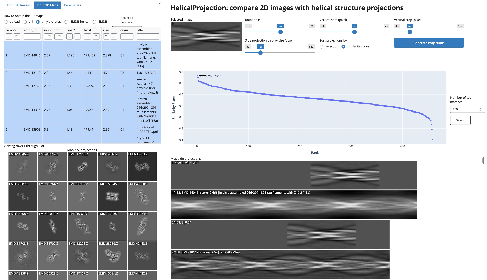

# HelicalProjection: compare 2D images with helical structure projections

**HelicalProjection** is a Web App that compares 2D images (e.g. 2D class averages) with projections of helical 3D structures.

No software installation is needed. Just [click me](https://cryoem.shinyapps.io/helicalprojection) to compare your 2D images with projections of helical 3D structures!</a>

